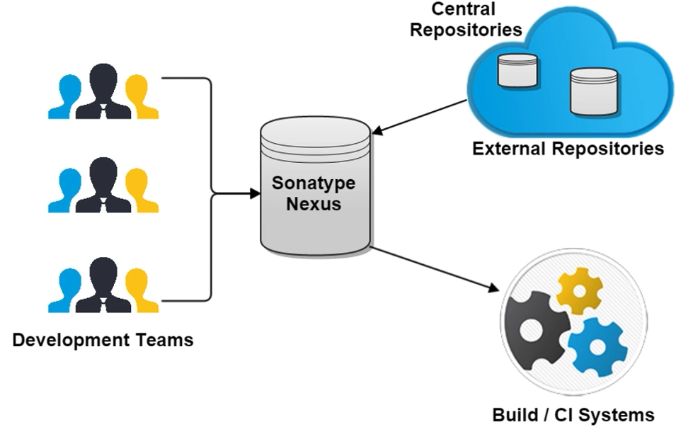

# Artifact-Nexus

아티팩트 저장소는 지속적 통합으로 생성된 빌드 아티팩트를 저장하며 이를 활용해 테스트, 스테이징 및 프로덕션 환경으로 자동화된 배포가 가능하다.

> 빌드 아티팩트란 배포 패키지, WAR 파일, 로그 및 보고서 등 빌드 프로세스에서 생성된 파일이다. CI 서버의 저장소 또는 CI 서버에서 이용 가능한 외부 위치에 아티팩트를 저장할 수 있다.

## 1. Nexus 란

<p align="center">

</p>

- 사내에서 개발 프로젝트를 진행할 때 외부 레파지토리에 접속하기 어렵다.
- 사내망에 프로젝트를 진행할 때 필요한 라이브러리를 다운받을 수 있도록 하는 것이 필요하다.
- 별도의 레파지토리를 구축해 사용한다.
  - 보안 (외부에 유출되지 않도록)
  - 라이브러리 버전 관리 용이 (메타데이터 기반으로 라이브러리 정보 관리)
  - 공유 및 협업 강화 (컴포넌트를 공유함)
- 이러한 레파지토리로 nexus를 사용할 수 있다.
- 다양한 아티팩트, 바이너리를 저장할 수 있다.

## 2. Nexus 장점

- 메인 저장소 캐시 역할 수행
  > https://sw-architect.tistory.com/10
- 자체 아티팩트 배포를 위한 프라이빗 레파
  지토리 만들 수 있음
- 보안 : 외부망 연결이 불가능할 경우 중앙 레파지토리에 연결을 못해서 빌드를 못하지만 nexus 레파지토리만 외부와 연결하게 설정하면 빌드가 가능하다.

## 3. Jenkins CI와 연동

<p align="center">

</p>

## 4. Blob Store

> 모든 넥서스 레파지토리는 블롭 스토어에 지정해줘야한다. 호스티드나 프록시 레파지토지를 통해 배포된 아티팩트를 저장하는 레파지토리이다.

## 5. Repository

- Snapshots : 빌드 등 수시로 릴리즈 되는 아티팩트 레파지토리
- Releases : 정식 릴리즈를 통해서 배포되는 아티팩트 레파지토리
- 3rd Party : 특정 밴더사에서 제공하는 아티팩트 레파지토리
- Proxy Repositroy : Local cache 용, 외부에 원본 레파지토리가 있는 경우 로컬 레파지토리의 캐시처럼 사용한다.
- Virtual Respository : 여러 레파지토리를 그룹화하여 하나의 레파지토리로 참조 가능

## 6. Repository Type

- Proxy : 외부망에 있는 레파지토리와 연동해 버전관리
- Hosted : 내부망 내 개발용으로 연동하는 레파지토리 (기본 타입)
- Virtual : 서로 다른 타입의 레파지토리를 연결 (어댑터 역할)
- Group : 위에 명시된 3개 타입을 그룹화

## 7. Nexus Repository 구성 방식

<p align="center">

</p>

- 단일 넥서스 인스턴스를 여러가지 레파지토리로, 심지어 개발, 테스트, 운영과 같은 다른 환경에서도 분리하거나 그룹화해서 구성 가능

- 온프라미스, 클라우드에서 실행할 수 있는 컨테이너 오케스트레이션, 전체 CI/CD 및 데이터 서비스를 위한 통합 플랫폼으로도 구성 가능

- 그림과 같이 그룹핑 단위로 용도나 정책을 맞추어 구성 가능

## 8. 설치

```
docekr run --name nexus -d -p 8081:8081 -v ~/nexus-data:/nexus-data -u root \
sonatype/nexus3
```

```
docker exec -it nexus bash -c "cat /nexus-data/admin.password"
```

- 로그인 이후 설정

  1. 비밀번호 설정
  2. anonymous access configuration
  3. security -> Users
  4. admin 권한 local user 생성

- aws s3 연결 blob store 및 repository 생성

  - blob stores에서 aws s3 bucket 생성 및 설정
    - default : 현재 aws ec2의 파일 시스템
    - createa blob store -> s3 선택
  - proxy 타입 repository 생성 (mavenCentral 캐싱)

- Nexus artifact 활용한 docker 빌드

  - gradle에서 repositoy를 nexus로 설정
  - nexus artifact 활용한 docekr 빌드

- Nexus artifact 활용한 docekr 빌드 수행
  - gradle 빌드시 nexus artifact 활용, jar 정상 생성 확인
  - jib를 이용해 docker빌드 및 이미지 push(aws ecr)
  - local에 docker 이미지 배포 및 컨테이너 실행

```
gradle clean build --info

aws ecr get-login-password--region ap-northeast2 | docker login --username AWS --password-stdin <AWS ECR repository URL>

gradle jib --console=plain

docker run -d -p 8080:8080 -t <aws ecr repository url>:tag
```
